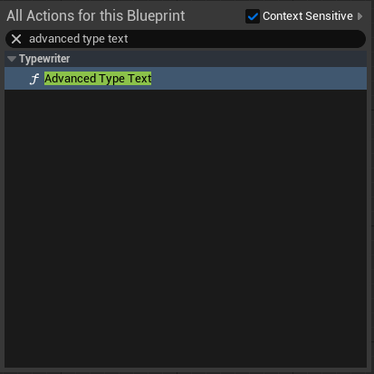
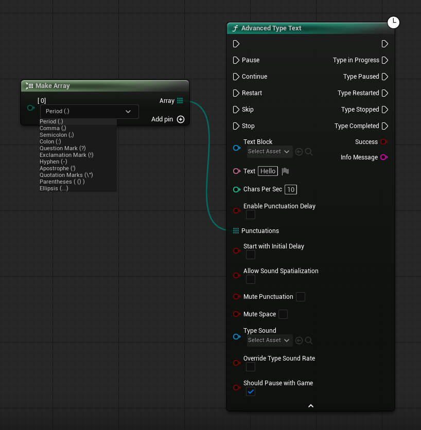

## How to use the advanced type text node.

Search for the advanced type text node in your graph. Keep in mind that this is a latent node and cannot be called inside functions.

The advanced node requires a value for scores even if you disable it.

This node has more configuration options, but in general it works like the simple node. Unlike the other one, this one does not have the ability to save an instance of the action; instead, you have different inputs and output executions to manipulate the action.

