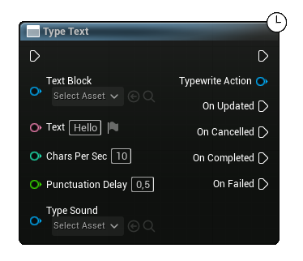

## How to use the simple type text node.

Search for the type text node in your graph. Keep in mind that this is a latent node and cannot be called inside functions.

This node is very easy to use, just configure the inputs according to the desired result.

This node returns an instance of this action, you can save it as a variable if you want to manipulate some actions of the node!

